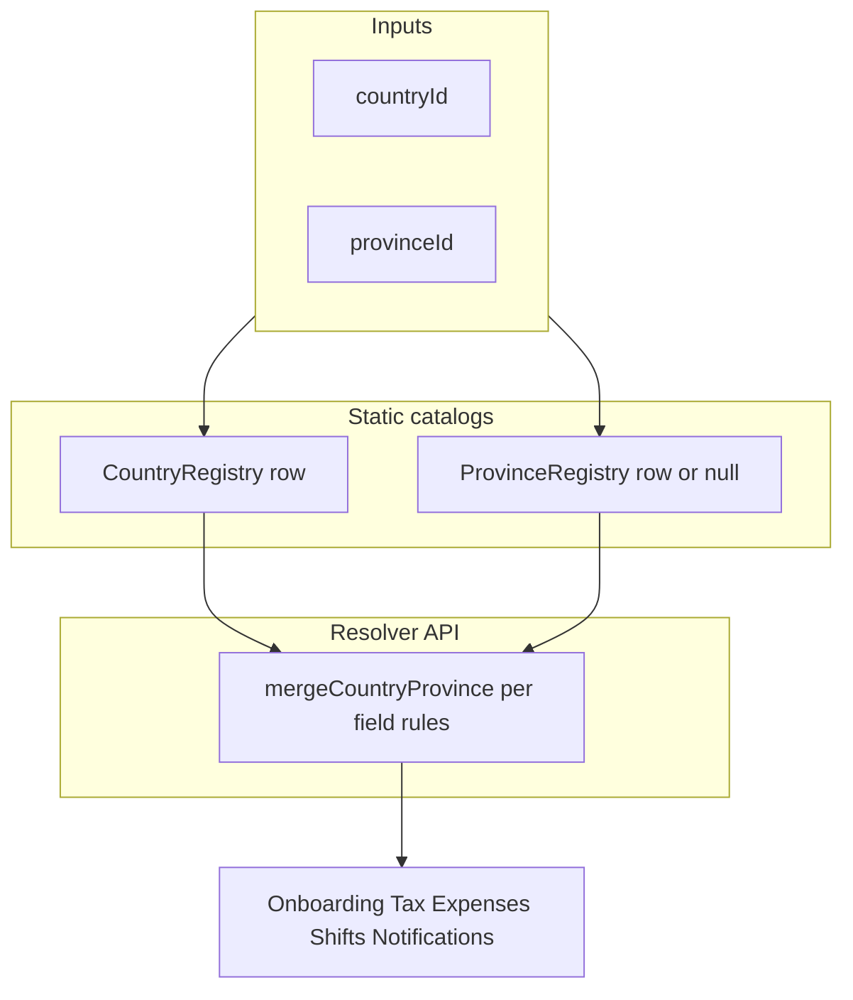

# Market resolution (country + province)

Single narrative for **country-first, province-override** market data, shared tax presets, and cross-cutting rules (identity, money, exports, store, audits).

**Code entrypoints**

- [`src/registry/market/resolve.js`](../src/registry/market/resolve.js) — `getMarketContext`, `resolveAvailablePlatformIds`.
- [`src/registry/tax/withholding-presets.js`](../src/registry/tax/withholding-presets.js) — `WITHHOLDING_PRESETS_CA` / `WITHHOLDING_PRESETS_US`, `getWithholdingPresetPct`, `listUsWithholdingRegionCodes` (US ids mirror `ProvinceRegistry.getByCountry('US')`).
- [`src/registry/provinces/`](../src/registry/provinces/) — `ProvinceRegistry`: **`{ISO}/*.province.js`** (one folder per two-letter country: `CA/`, `US/`, `UK/`, …). Run **`npm run rebuild:provinces`** to refresh [`index.js`](../src/registry/provinces/index.js) from those folders. US states default through [`US/_usStateProvince.js`](../src/registry/provinces/US/_usStateProvince.js); keep [`withholding-presets.js`](../src/registry/tax/withholding-presets.js) `WITHHOLDING_PRESETS_US` in sync when adding a US code.
- **`store.marketContext`** — same shape as `getMarketContext(...)` after each user sync (see [`store.js`](../src/core/store.js)).

---

## Merge model (overview)

### Platform allow-list (encoded in `resolveAvailablePlatformIds`)

| Step | Rule |
|------|------|
| 1 | If `resolveProvinceDef(countryId, provinceId)` has **non-empty** `availablePlatforms`, use it (province wins). |
| 2 | Else if country row has **`defaultAvailablePlatforms`** (non-empty), use it. |
| 3 | Else if `ProvinceRegistry.getByCountry(countryId)` is non-empty, **union** all their `availablePlatforms`. |
| 4 | Else all ids in `PlatformRegistry`. |

Platform ids stay **lowercase** end-to-end (Dexie seeds, defs, resolvers).

### Withholding presets

| Source | Rule |
|--------|------|
| Maps | Only [`withholding-presets.js`](../src/registry/tax/withholding-presets.js) — do not duplicate in modules. |
| **Subdivisions** | One `*.province.js` per region under [`provinces/{ISO}/`](../src/registry/provinces/) (see [`CA/ON`](../src/registry/provinces/CA/ON.province.js), [`US/`](../src/registry/provinces/US/) + [`_usStateProvince.js`](../src/registry/provinces/US/_usStateProvince.js)). Refresh [`index.js`](../src/registry/provinces/index.js) with **`npm run rebuild:provinces`**. US: also add `WITHHOLDING_PRESETS_US` when withholding applies. |
| Selector | Country `tax.regionPresetType` is `'CA'`, `'US'`, or `null` (UK has no map). |
| Fallback | US unknown code uses `tax.defaultWithholdingPct`; CA unknown should not occur if region matches catalog. |

---

## Market identity (precedence)

When reading “which market is this user?” use this order:

| Priority | Field | Role |
|----------|--------|------|
| 1 | **`user.countryId`** | Canonical ISO market (`CA`, `US`, `UK`). Prefer for registry resolution. |
| 2 | **`user.provinceId`** | Subdivision; may be empty for some UK flows. Used with `countryId` in `resolveProvinceDef`. |
| 3 | **`user.locale.country`** (and currency / `distanceUnit`) | Display and `Intl`; should match `countryId` after onboarding and migrations. If conflict during **imports**, normalize toward `countryId` + [`getLocaleConfig(countryId)`](../src/utils/locale.js). |

**Store / sync:** [`syncLocaleDefsFromUser`](../src/core/store.js) resolves `countryId` from `user.countryId` first, then `locale.country`, then `'CA'` only as last-resort default. **`provinceId`** uses the stored value when non-empty; for **legacy Canada-only** rows with missing `provinceId`, default **`ON`** only when `countryId === 'CA'`. Non-CA users must not silently get `ON`.

---

## Money and units (storage vs UI)

| Concept | Storage / persistence | UI / draft |
|--------|------------------------|------------|
| Goals (`weeklyGoal`, etc. on user) | **Integer cents** (plan v3) | Onboarding draft often uses **dollar integers** until `saveUser` multiplies by 100 — see [`onboarding.js`](../src/modules/onboarding/onboarding.js) `buildCompletedUserPatch`. |
| Shift `grossEarnings` | **Cents** | Forms may show dollars; convert at save boundary. |
| Distance | Shifts use **`distanceKm`** in storage | `locale.distanceUnit` is `'km'` \| `'mi'` for display only — do not infer country from km alone. |

Canonical conversion helpers live next to the modules that own the forms (shift form, onboarding, goals), not inside aggregations.

---

## Dexie `DEFAULT_USER` vs registry (alignment)

| Field | `DEFAULT_USER` ([`db.js`](../src/core/db.js)) | Registry / product intent |
|-------|-----------------------------------------------|----------------------------|
| `countryId` / `locale.country` | `CA` | Matches [`CA.country.js`](../src/registry/countries/CA.country.js). |
| `provinceId` | `ON` | Matches [`CA/ON.province.js`](../src/registry/provinces/CA/ON.province.js) as default catalog market. |
| `taxWithholdingPct` | `29` | Matches **`WITHHOLDING_PRESETS_CA.ON`** in [`withholding-presets.js`](../src/registry/tax/withholding-presets.js) (not `tax.defaultWithholdingPct` 28 — preset row is the seed for set-aside UI). |

Logical migration **schema 1** backfills `countryId` / `provinceId`; non-CA users must not receive **`ON`** as `provinceId` when absent — use **`''`** except Canada → **`ON`**.

---

## CA / ON grep triage (audit backlog)

| Location | Verdict |
|----------|---------|
| [`CountryRegistry` / `ProvinceRegistry` `FALLBACK_ID`](../src/registry/countries/index.js) | **Intentional** global catalog default. |
| [`DEFAULT_USER`](../src/core/db.js), Dexie v3 migration shift backfill | **Intentional** Ontario-first product default. |
| [`resolveProvinceDef('CA','')`](../src/utils/locale.js) single-province return | **Intentional** for Canada-only catalog. |
| [`shifts.js`](../src/modules/shifts/shifts.js) `resolveProvinceId` final `'ON'` | **Intentional** last resort when user unset (documented; prefer user `provinceId` when present). |
| [`expenses.js`](../src/modules/expenses/expenses.js) same pattern | Same as shifts. |
| [`vehicles.js`](../src/modules/vehicles/vehicles.js) recurring expense `provinceId` | **Updated** to use `store.get('user')` — CA → `ON`, else user `provinceId` or `''`. |
| [`db.js`](../src/core/db.js) logical migration `provinceId` for non-CA | **Fixed** to avoid assigning `ON` to US/UK users. |

Re-run `rg "'CA'|'ON'" src` after major features; new hits should be classified the same way.

---

## Exports and portability (setup JSON)

Onboarding setup export ([`buildOnboardingSetupExport`](../src/modules/onboarding/onboarding.js)) includes:

| Field | Purpose |
|-------|---------|
| `exportKind` | Always **`comma_setup`** for this file shape. |
| `version` | Numeric **export schema version** (currently `1`). Bump when adding/removing top-level keys. |
| `countryId` | Same as draft country (stable market id). |
| `provinceId` | Same as draft `taxRegion` / completed `provinceId` (subdivision or free-text code). |
| `platforms` | Array of **platform id** strings (lowercase). |

Full vault backups use Dexie + separate processes; keep **platform / country / province ids** stable when renaming catalog entries (add migration mapping if ids ever change).

---

## Store and events

- **`store.marketContext`**: `{ countryId, provinceId, countryDef, provinceDef }` from [`getMarketContext`](../src/registry/market/resolve.js). Updates whenever `user` is set. Subscribe for UI that needs both defs without re-importing registries.
- **`store.provinceDef`** may be **`null`** (e.g. US state not in `ProvinceRegistry`). Do not assume Ontario `expenseCategories`; [`getAllCategories()`](../src/modules/expenses/expenses.js) already merges globals when province data is missing.
- **Bus payloads**: include **`source`** (string) on app-emitted events so listeners can avoid feedback loops (`sample`, `onboarding`, etc.).

---

## Adding a province that overrides country defaults

When a new `*.province.js` exists with `availablePlatforms`, resolvers **prefer** it over `country.defaultAvailablePlatforms`. No separate “exempt list” in code.

---

## Related docs

- [adding-a-country.md](adding-a-country.md), [adding-a-province.md](adding-a-province.md), [adding-a-platform.md](adding-a-platform.md)
- [feature_modularity.md](feature_modularity.md) (Category A — link from registry section)
- [Registry_arch.md](Registry_arch.md)
